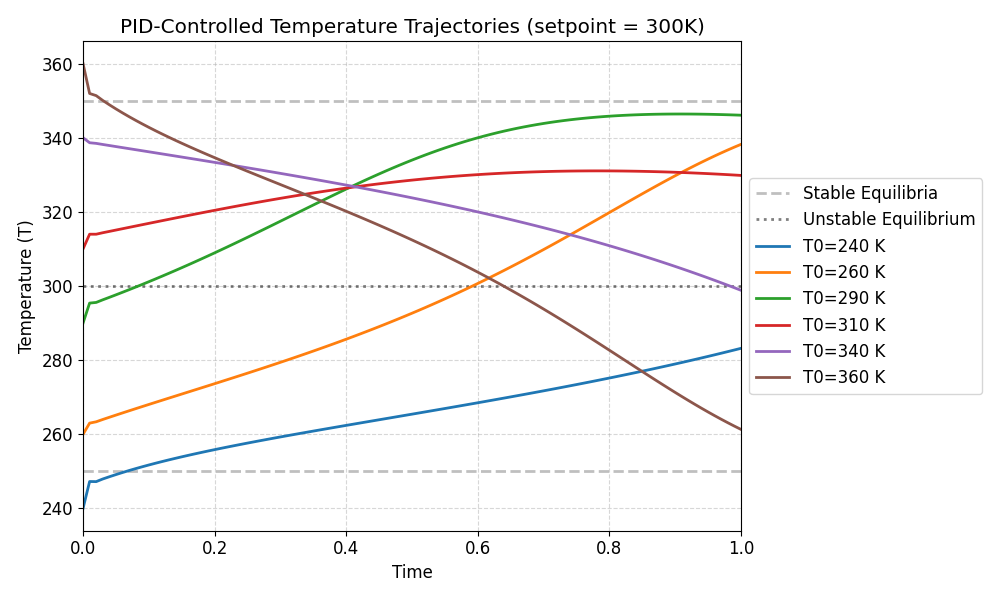
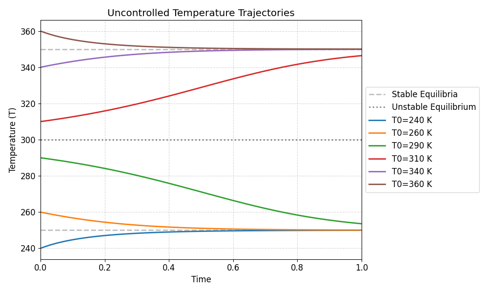
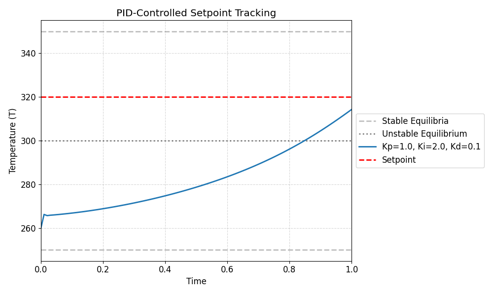
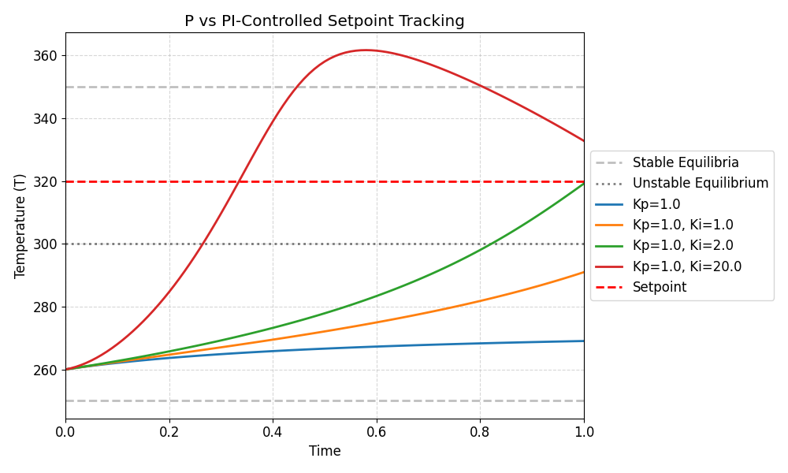
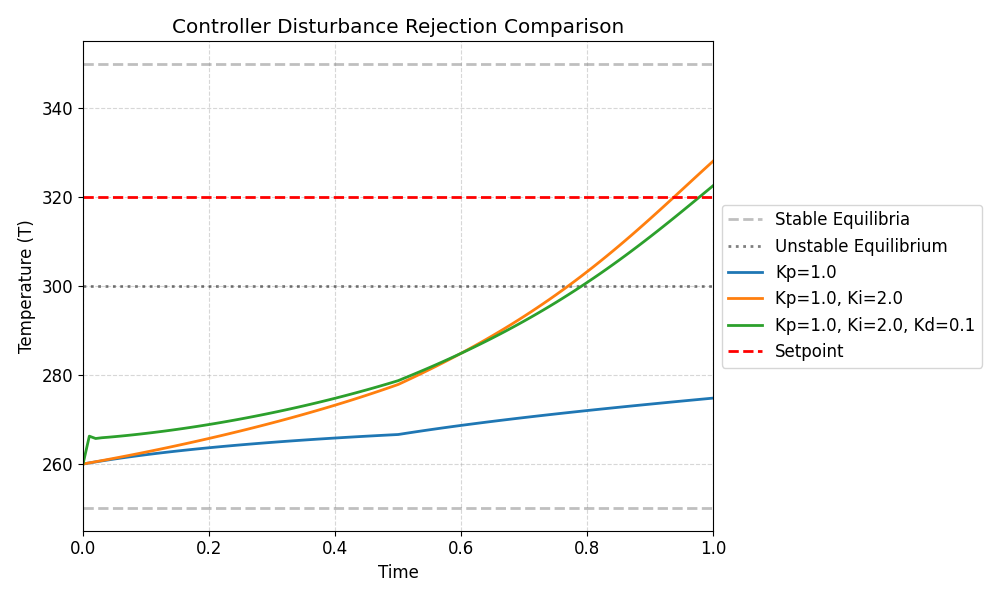
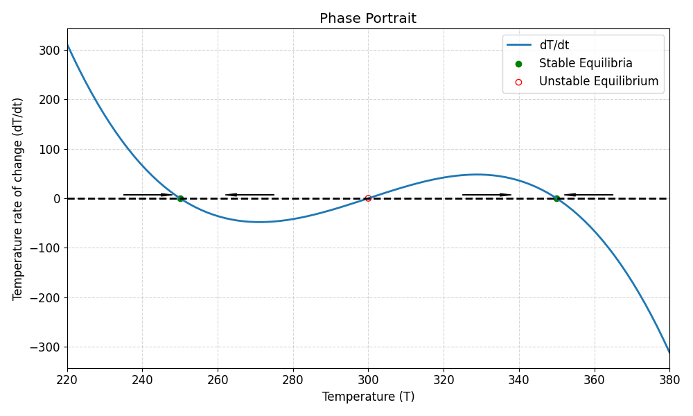

# Process Dynamics and Control Lab


<p align="center">
  
</p>

<p align="center">
PID-controlled temperature trajectories for a nonlinear first-order reactor system.
</p>

---

A Python-based simulation framework for analyzing **nonlinear reactor dynamics** under feedback control.

This project models a nonlinear first-order dynamic system with multiple equilibrium points and applies classical control strategies (**P, PI, PID**) to stabilize and regulate temperature behavior.

The simulator includes numerical integration, controller comparison, disturbance rejection analysis, phase portraits, and parameter tuning studies.

---

# Features

This project implements:

- Nonlinear first-order reactor dynamics with multiple equilibria
- Euler numerical simulation of system trajectories
- P, PI, and PID feedback controllers
- Setpoint tracking experiments
- Controller tuning studies (Kp, Ki, Kd sweeps)
- Disturbance rejection analysis
- Stability and overshoot comparison
- Phase portrait visualization (open-loop vs closed-loop)
- CSV export of all simulation data
- Automated plot generation for all experiments

---

# System Model

The reactor is modeled as:

```text
dT/dt = -k · (T - T₁) · (T - T₂) · (T - T₃)
```

Where:
- T₁ = 250 K (stable equilibrium)
- T₂ = 300 K (unstable equilibrium)
- T₃ = 350 K (stable equilibrium)

This produces a **multi-stable nonlinear system** commonly used to study control stability and bifurcations.

---

# Control Strategies

## P Controller

```text
u = Kp · (Tset - T)
```

## PI Controller

```text
u = Kp · e + Ki · ∫e dt
```

## PID Controller

```text
u = Kp · e + Ki · ∫e dt + Kd · de/dt
```

Controllers are used to regulate system temperature toward a defined setpoint (typically 320 K).

---

# Experiments

The project includes multiple structured experiments:

## 1. Basin of Attraction Study
- Tests system behavior from multiple initial conditions
- Compares controlled vs uncontrolled dynamics

## 2. Setpoint Tracking
- Evaluates controller performance in tracking a fixed target temperature

## 3. Tuning Studies
- Sweeps across:
  - Kp values (P controller)
  - Ki values (PI controller)
  - Kd values (PID controller)
- Evaluates overshoot, stability, and response speed

## 4. Disturbance Response
- Applies a step disturbance at t = 0.5 s
- Compares rejection performance of P, PI, and PID controllers

## 5. Stability Comparison
- Demonstrates PID instability under high derivative gain
- Compares P vs PI performance tradeoffs

## 6. Phase Portrait Analysis
- Visualizes system vector field
- Compares open-loop vs closed-loop dynamics

---

# Example Outputs

### Basin of Attraction Study

<p align="center">
  
</p>

<p align="center">
Trajectories from multiple initial conditions converging toward stable equilibrium states.
</p>

---

### PID Setpoint Tracking

<p align="center">
  
</p>

<p align="center">
PID controller response during setpoint tracking to 320 K.
</p>

---

### P vs PI Comparison

<p align="center">
  
</p>

<p align="center">
Comparison of proportional and proportional-integral control performance during setpoint tracking.
</p>

---

### Disturbance Response

<p align="center">
  
</p>

<p align="center">
Controller responses to a step disturbance introduced during operation.
</p>

---

### Phase Portrait

<p align="center">
  
</p>

<p align="center">
Phase portrait showing stable and unstable equilibrium points of the nonlinear reactor model.
</p>

---

# Data Export

All simulation results are exported as structured CSV files:
```
results/data/
|--- basin_dynamics/
|--- setpoint_tracking/
|--- disturbance_response/
```

Each CSV file contains simulation time data and one or more temperature trajectories generated during the experiments.

The exported data can be analyzed further using Python, Excel, MATLAB, or other scientific computing tools.

This allows external analysis in Python, Excel, or MATLAB.

---

# Project Structure

```
Process-Dynamics-and-Control-Lab/
|
|--- controllers/
|    |--- p.py
|    |--- pi.py
|    |--- pid.py
|
|--- experiments/
|    |--- basin_study.py
|    |--- setpoint_tracking.py
|    |--- tuning_study.py
|    |--- disturbance_response.py
|
|--- models/
|    |--- first_order_system.py
|
|--- simulation/
|    |--- simulator.py
|
|--- visualization/
|    |--- plots.py
|
|--- utils/
|    |--- data_export.py
|
|--- parameters.py
|--- main.py
|
|--- results/
|    |--- plots/
|    |--- data/
|
|--- requirements.txt
|--- LICENSE
|--- .gitignore
|--- README.md
```

---

# Installation

## Clone the repository

```bash
git clone https://github.com/MatthewNguyen865/Process-Dynamics-and-Control-Lab.git
```

## Install dependencies

```bash
pip install -r requirements.txt
```

## Run Simulation

```bash
python main.py
```

This will:

- run all experiments  
- generate plots  
- export CSV data into `results/data/`

---

# Engineering Concepts Used

### Control Systems
- Feedback control loops
- PID tuning
- Stability and overshoot analysis

### Numerical Methods
- Euler integration
- Discrete-time simulation
- Finite difference derivatives

### Chemical Engineering / Process Systems
- Nonlinear reactor dynamics
- Multiple steady states and stability analysis
- Process control and setpoint regulation
- Disturbance rejection in process systems

---

# Future Improvements

- Add anti-windup for integral term  
- Replace Euler method with RK4 solver  
- Add automatic PID tuning (Ziegler–Nichols)  
- Add interactive dashboard (Plotly / Streamlit)  
- Extend to coupled mass and energy balance models 

---

# Author

Matthew Nguyen  
Chemical Engineering Student  
Texas A&M University